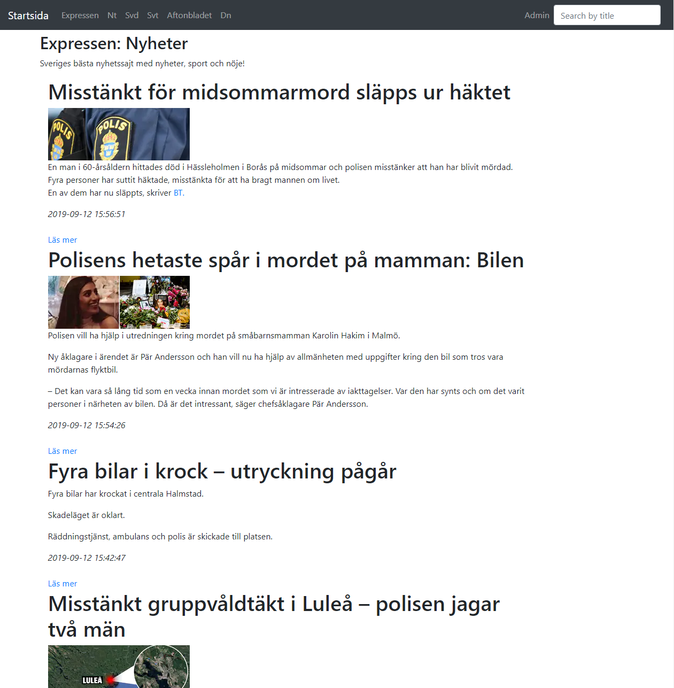

# NyhetssajtApp

 

The front-end was generated with [Angular CLI](https://github.com/angular/angular-cli) version 7.1.4. The backend was  
created in C# .Net Core 2.2

## Instructions

1. Clone the repo and open the solution Nyhetssajt.sln located in the WebAPI folder

2. Open Microsoft SQL Server Management Studio and create a new database called NewsDB

3. Select `.Net Core2.2` as target framework in your soultion properties (install .Net Core2.2 if it's not available)

4. Open launchSettings.json copy the applicationUrl adress under iisExpress and replace it `angular7/globals.ts`.

5. In Nuget Package Manager run:
 - `Install-Package NuGet.Frameworks -Version 5.2.0`
 - `Add-Migration InitMigartion -Context Nyhetssajt.Models.CustomContext`
 - `UpdateDatabase -Context Nyhetssajt.Models.CustomContext`

6. Hit F5 to start the solution

7. Navigate to the Angular7 folder with in Visual Studio Code terminal and run:
`npm install`

8. Run `ng serve` for a dev server. Navigate to `http://localhost:4200/`. The app will automatically reload if you change any of the source files.
